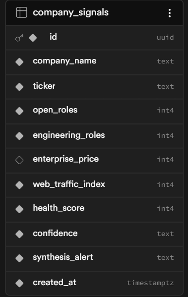

# Alternative Data Radar

Hackathon MVP for turning public web signals into pre-earnings intelligence.

## Quick Start

```bash
npm install
copy .env.example .env.local
npm run dev
```

The app defaults to `DEMO_MODE=true`, so it runs without API keys.

## Live Integrations

When keys are ready, update `.env.local`:

```env
DEMO_MODE=false
NEXT_PUBLIC_SUPABASE_URL=
SUPABASE_SERVICE_ROLE_KEY=
AIML_API_KEY=
BRIGHT_DATA_API_KEY=
BRIGHT_DATA_WEB_UNLOCKER_ZONE=
CRON_SECRET=
```

Create the Supabase table with `supabase/schema.sql`.

## API Routes

- `GET /api/signals/latest` returns signal rows for the dashboard.
- `POST /api/signals/collect` runs the collection pipeline. In demo mode it returns a safe setup message instead of calling paid APIs.

Example live collection body:

```json
{
  "companyName": "Example SaaS Co.",
  "ticker": "EXMP",
  "careersUrl": "https://example.com/careers",
  "pricingUrl": "https://example.com/pricing"
}
```

## Architecture

See `docs/architecture.md` for the filesystem diagram and service relationships.

## table schema (postgres-supabase)


## Sample response
``{
    "signal": {
        "id": "d51296a4-2798-4af2-b169-8dced9b2ad1c",
        "companyName": "Y Combinator",
        "ticker": "YC",
        "openRoles": 12,
        "engineeringRoles": 12,
        "enterprisePrice": null,
        "webTrafficIndex": 50,
        "healthScore": 48,
        "confidence": "low",
        "synthesisAlert": "Warning: If the number of open engineering roles drops to zero, it may indicate a hiring freeze.",
        "createdAt": "2026-05-30T13:15:18.286+00:00"
    }
}``